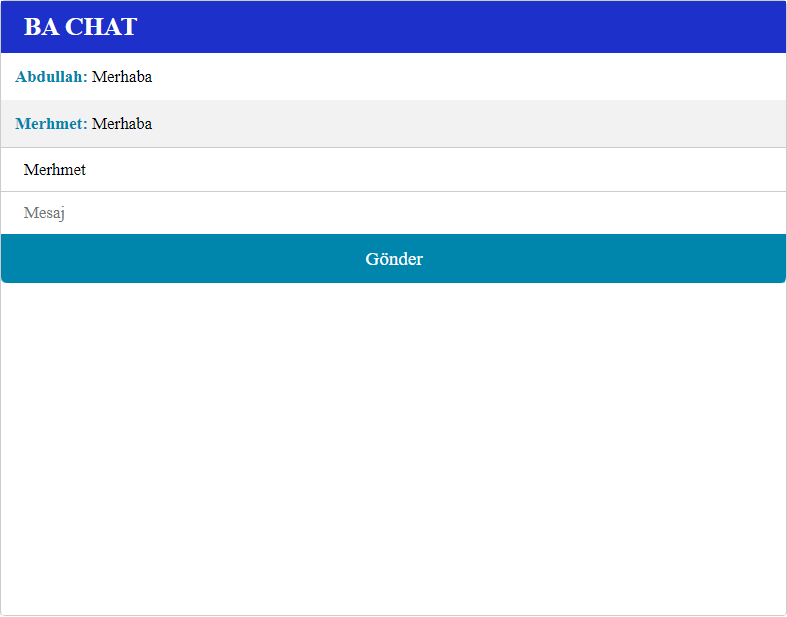
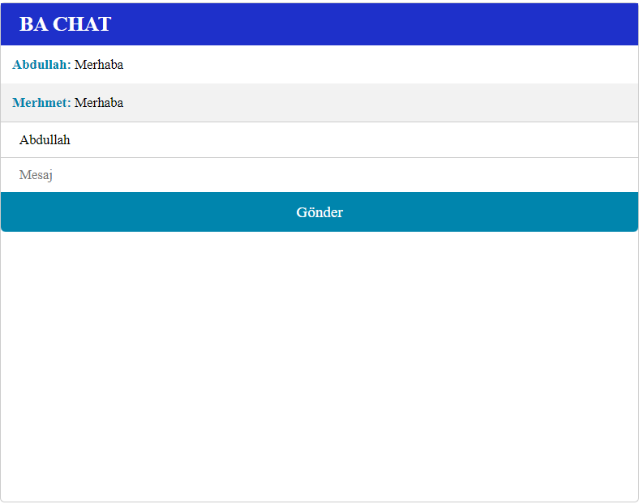

# chat-app
socket.io express kullanılarak yapılan basit bir chat uygulaması

## İçerik
- [node](#node)
- [socket-io](#socket-io)

## Başlangıç <a name = "getting_started"></a>

### Kurulum İçin Gerekenler
- <a href="https://www.docker.com/products/docker-desktop/">Docker</a>

### Kurulum

```
Git clone https://github.com/abdullahciftci034/chat-app.git
```
```
cd chat-app
```
```
docker-compose build
```
```
docker-compose up
```
### Preview


